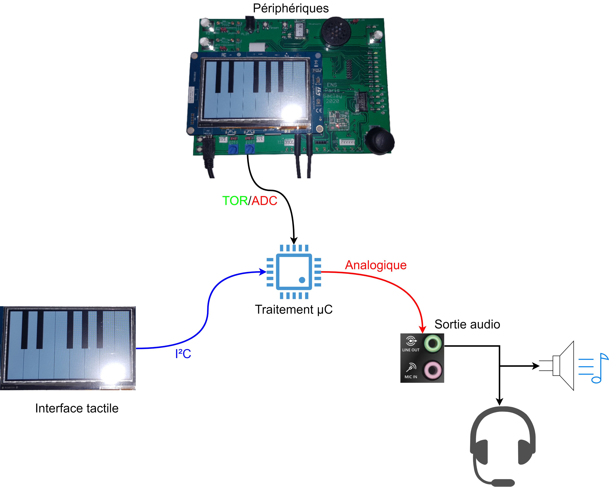

# Bienvenue sur le projet Expandeur MIDI V2 !
(En vérité c'est un Piano tactile avec une meilleure qualité audio)

## Introduction
Les mini-projets du premier s'étant terminés d'une très bonne manière pour la plupart des élèves de la promotion, un mini-projet s'est malheuresement terminé avec quelques soucis de puissance de calcul. Par miracle la carte du second semestre est bien plus puissante et possède plus de fonctionnalités ainsi que de vastes horizons explorés comme non explorés sur internet !

Voici donc la nouvelle carte si bien introduite.

Ainsi que le schéma synoptique expliquant le fonctionnement du projet.
